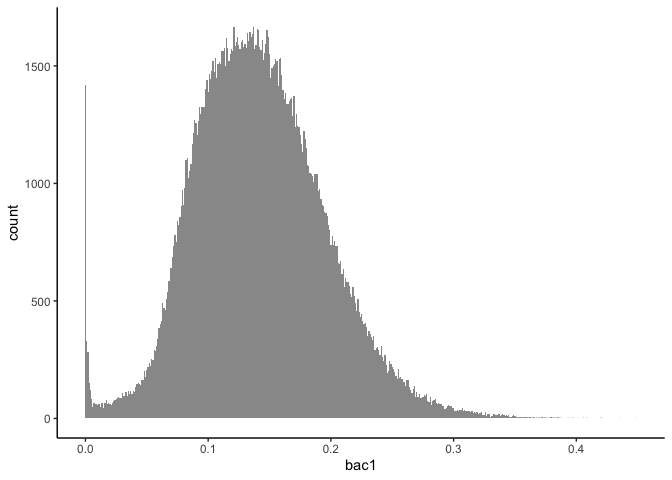
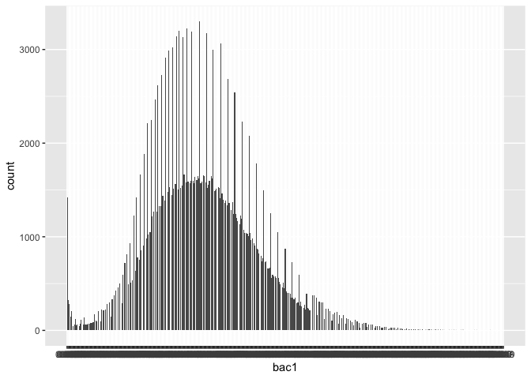
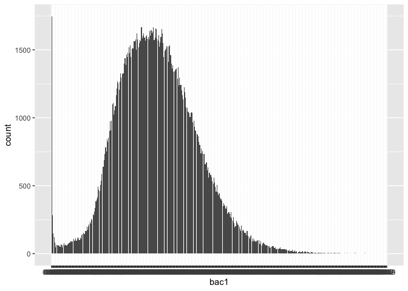
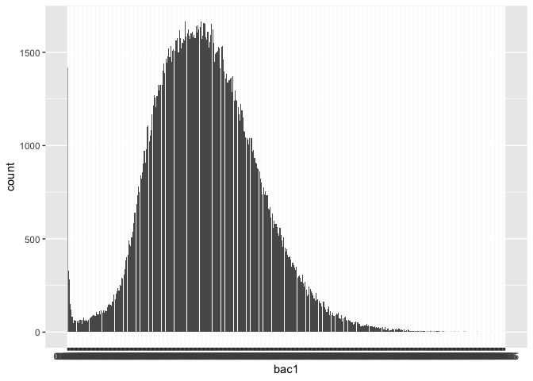

BAC histograms
================
Yurun (Ellen) Ying
2022-12-13

## Treating BAC as a discrete variable

First we try to replicate the output given by stata function
`histogram bac1, discrete width(0.001)`.

The default histogram of ggplot2 does a great job.

``` r
bac_data %>% 
  ggplot(aes(x = bac1)) +
  geom_histogram(binwidth = 0.001, fill = "grey60", color = NA) + 
  theme_classic()
```

<!-- -->

Which is interesting since the `geom_histogram` treats the variable to
be plotted as a continuous variable, rather than discrete.

Now try to convert BAC into a discrete variable with the combinaiton of
funcitons `scale_x_binned` and `geom_bar`.

``` r
# if set the breaks to seq(0, max, by = 0.001), heaping occurs
bac_data %>% 
  ggplot(aes(x = bac1)) +
  scale_x_binned(breaks = seq(0, max(bac_data$bac1), by = 0.001)) +
  geom_bar()
```

<!-- -->

``` r
# when the data is rounded, heaping disappears
# but the resulting plot is slightly different from the one given by geom_hist
# closer to the one given by stata (discrete plot)
bac_data %>% 
  mutate(bac1 = round(bac1, 3)) %>%
  ggplot(aes(x = bac1)) +
  scale_x_binned(breaks = seq(0, max(bac_data$bac1), by = 0.001)) +
  geom_bar()
```

<!-- -->

``` r
# alternatively, shift the breaks to the left by half of binwidth also makes heaping disappear
# this is equivalent to the default setting of the geom_histogram function
bac_data %>% 
  ggplot(aes(x = bac1)) +
  scale_x_binned(breaks = seq(-0.0005, max(bac_data$bac1) + 0.0005, by = 0.001)) +
  geom_bar()
```

<!-- -->

From the information above, let’s attempt an answer to the first
question:

- The outputs given by breathalyzers were not complete accurate to three
  decimal points: they tend to cluster at a value very slightly higher
  or lower
- For bins where the value at the left boundary was estimated upwards
  and the values at the right boundary was estimated downwards, heaping
  can occur *iff*:
  - we treat BAC as a continuous variable AND
  - we use bin breaks exactly at values rounded to three decimal points
- Heaping will not occur if we either:
  - round all the values to the nearest 0.001 OR
  - use breaks that are shifted leftwards by half of binwidth
    (i.e. 0.0005) OR
  - treat BAC as discrete and give each unique value its own bin (as
    stata histogram discrete option does)
