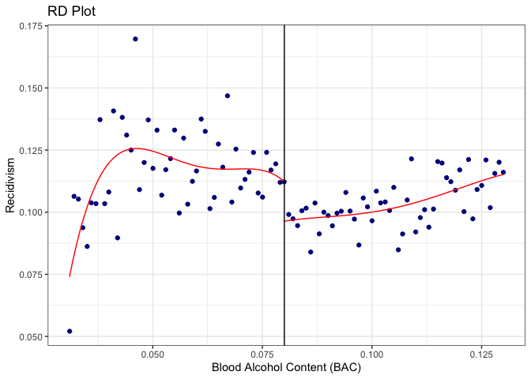

20221215_main_analysis
================
Yurun (Ellen) Ying
2022-12-15

## Main analysis

Run the main analysis of the effect of treatment (punishment) on
recidivism.

``` r
# analysis officially given in the do file
# get the data within the 0.05 bandwidth
dat_bandwidth_0.05 <- bac_data %>% filter(abs(bac1_ctd) <= 0.05)

# linear regression
linear_a <- 
  dat_bandwidth_0.05 %>% 
  lm(recidivism ~ dui*bac1_ctd + white + male + acc + aged,
     data = .)
summaryR.lm(linear_a, type = "hc1")
```

    ## Loading required package: car

    ## Loading required package: carData

    ## 
    ## Attaching package: 'car'

    ## The following object is masked from 'package:dplyr':
    ## 
    ##     recode

    ## The following object is masked from 'package:purrr':
    ## 
    ##     some

    ## 
    ## Call:
    ## lm(formula = recidivism ~ dui * bac1_ctd + white + male + acc + 
    ##     aged, data = .)
    ## 
    ## Residuals:
    ##      Min       1Q   Median       3Q      Max 
    ## -0.14367 -0.11932 -0.10644 -0.08617  0.96543 
    ## 
    ## Coefficients:
    ##                Estimate Std. Error t value Pr(>|t|)    
    ## (Intercept)   1.059e-01  5.355e-03  19.780  < 2e-16 ***
    ## dui          -2.402e-02  4.353e-03  -5.518 3.44e-08 ***
    ## bac1_ctd     -4.287e-02  1.866e-01  -0.230   0.8183    
    ## white         1.622e-02  2.802e-03   5.789 7.10e-09 ***
    ## male          3.318e-02  2.329e-03  14.247  < 2e-16 ***
    ## acc           4.210e-03  3.452e-03   1.219   0.2227    
    ## aged         -8.537e-04  8.497e-05 -10.047  < 2e-16 ***
    ## dui:bac1_ctd  4.381e-01  2.038e-01   2.150   0.0316 *  
    ## ---
    ## Signif. codes:  0 '***' 0.001 '**' 0.01 '*' 0.05 '.' 0.1 ' ' 1
    ## 
    ## Residual standard error: 0.3085 on 89959 degrees of freedom
    ## Multiple R-squared:  0.003644,   Adjusted R-squared:  0.003566 
    ## F-statistic: 51.13 on 7 and 89959 DF,  p-value: < 2.2e-16
    ## 
    ## Note: Heteroscedasticity-consistent standard errors using adjustment hc1

``` r
# quadratic model
qua_a <- 
  dat_bandwidth_0.05 %>% 
  lm(recidivism ~ dui*(bac1_ctd + bac1_ctd_sq) + white + male + acc + aged,
     data = .)
summaryR.lm(qua_a, type = "hc1")
```

    ## 
    ## Call:
    ## lm(formula = recidivism ~ dui * (bac1_ctd + bac1_ctd_sq) + white + 
    ##     male + acc + aged, data = .)
    ## 
    ## Residuals:
    ##      Min       1Q   Median       3Q      Max 
    ## -0.14704 -0.11889 -0.10633 -0.08583  0.96541 
    ## 
    ## Coefficients:
    ##                   Estimate Std. Error t value Pr(>|t|)    
    ## (Intercept)      1.001e-01  6.271e-03  15.970  < 2e-16 ***
    ## dui             -1.432e-02  6.222e-03  -2.302   0.0213 *  
    ## bac1_ctd        -1.053e+00  6.012e-01  -1.751   0.0800 .  
    ## bac1_ctd_sq     -2.472e+01  1.374e+01  -1.799   0.0720 .  
    ## white            1.622e-02  2.802e-03   5.790 7.08e-09 ***
    ## male             3.321e-02  2.329e-03  14.262  < 2e-16 ***
    ## acc              4.184e-03  3.451e-03   1.212   0.2254    
    ## aged            -8.538e-04  8.497e-05 -10.048  < 2e-16 ***
    ## dui:bac1_ctd     1.027e+00  6.890e-01   1.490   0.1362    
    ## dui:bac1_ctd_sq  3.273e+01  1.510e+01   2.167   0.0302 *  
    ## ---
    ## Signif. codes:  0 '***' 0.001 '**' 0.01 '*' 0.05 '.' 0.1 ' ' 1
    ## 
    ## Residual standard error: 0.3085 on 89957 degrees of freedom
    ## Multiple R-squared:  0.003697,   Adjusted R-squared:  0.003598 
    ## F-statistic: 40.23 on 9 and 89957 DF,  p-value: < 2.2e-16
    ## 
    ## Note: Heteroscedasticity-consistent standard errors using adjustment hc1

``` r
# get the data within the 0.025 bandwidth
dat_bandwidth_0.025 <- bac_data %>% filter(abs(bac1_ctd) <= 0.025)

# linear regression
linear_b <- 
  dat_bandwidth_0.025 %>% 
  lm(recidivism ~ dui*bac1_ctd + white + male + acc + aged,
     data = .)
summaryR.lm(linear_b, type = "hc1")
```

    ## 
    ## Call:
    ## lm(formula = recidivism ~ dui * bac1_ctd + white + male + acc + 
    ##     aged, data = .)
    ## 
    ## Residuals:
    ##      Min       1Q   Median       3Q      Max 
    ## -0.14392 -0.11723 -0.10479 -0.08299  0.96339 
    ## 
    ## Coefficients:
    ##                Estimate Std. Error t value Pr(>|t|)    
    ## (Intercept)   0.0976074  0.0069612  14.022  < 2e-16 ***
    ## dui          -0.0205774  0.0057465  -3.581 0.000343 ***
    ## bac1_ctd     -0.1955582  0.3825057  -0.511 0.609175    
    ## white         0.0175942  0.0038129   4.614 3.95e-06 ***
    ## male          0.0357191  0.0031666  11.280  < 2e-16 ***
    ## acc           0.0042208  0.0049681   0.850 0.395565    
    ## aged         -0.0007579  0.0001154  -6.570 5.10e-11 ***
    ## dui:bac1_ctd  0.5470655  0.4493585   1.217 0.223444    
    ## ---
    ## Signif. codes:  0 '***' 0.001 '**' 0.01 '*' 0.05 '.' 0.1 ' ' 1
    ## 
    ## Residual standard error: 0.3063 on 46949 degrees of freedom
    ## Multiple R-squared:  0.003994,   Adjusted R-squared:  0.003845 
    ## F-statistic: 29.17 on 7 and 46949 DF,  p-value: < 2.2e-16
    ## 
    ## Note: Heteroscedasticity-consistent standard errors using adjustment hc1

``` r
# quadratic model
qua_b <- 
  dat_bandwidth_0.025 %>% 
  lm(recidivism ~ dui*(bac1_ctd + bac1_ctd_sq) + white + male + acc + aged,
     data = .)
summaryR.lm(qua_b, type = "hc1")
```

    ## 
    ## Call:
    ## lm(formula = recidivism ~ dui * (bac1_ctd + bac1_ctd_sq) + white + 
    ##     male + acc + aged, data = .)
    ## 
    ## Residuals:
    ##      Min       1Q   Median       3Q      Max 
    ## -0.14383 -0.11690 -0.10477 -0.08279  0.96308 
    ## 
    ## Coefficients:
    ##                   Estimate Std. Error t value Pr(>|t|)    
    ## (Intercept)      9.431e-02  8.038e-03  11.733  < 2e-16 ***
    ## dui             -1.410e-02  8.460e-03  -1.667   0.0956 .  
    ## bac1_ctd        -1.203e+00  1.344e+00  -0.895   0.3707    
    ## bac1_ctd_sq     -4.606e+01  5.875e+01  -0.784   0.4330    
    ## white            1.759e-02  3.813e-03   4.614 3.96e-06 ***
    ## male             3.575e-02  3.167e-03  11.291  < 2e-16 ***
    ## acc              4.233e-03  4.968e-03   0.852   0.3941    
    ## aged            -7.582e-04  1.154e-04  -6.571 5.06e-11 ***
    ## dui:bac1_ctd     8.822e-01  1.675e+00   0.527   0.5984    
    ## dui:bac1_ctd_sq  7.127e+01  6.921e+01   1.030   0.3031    
    ## ---
    ## Signif. codes:  0 '***' 0.001 '**' 0.01 '*' 0.05 '.' 0.1 ' ' 1
    ## 
    ## Residual standard error: 0.3063 on 46947 degrees of freedom
    ## Multiple R-squared:  0.004017,   Adjusted R-squared:  0.003826 
    ## F-statistic: 22.78 on 9 and 46947 DF,  p-value: < 2.2e-16
    ## 
    ## Note: Heteroscedasticity-consistent standard errors using adjustment hc1

The linear model estimates using a rectangular kernel weight indicate
that receiving punishment decreased the rate of recidivism by 2.40
percentage point (2.06 percentage when using 0.025 bandwidth). The
quadratic model estimates indicate that receiving punishment decreased
the rate of recidivism by 1.43 percentage point (1.41 percentage when
using 0.025 bandwidth).

### Sensitivity analysis

For sensitivity analysis, triangular kernel function was used to weight
observations.

``` r
# Add a triangular kernel weight
tri_weight <- function(x, h) {
    # To start at a weight of 0 at x = 0, and impose a bandwidth of h, 
    # we need a "slope" of -1/h, and to go in either direction use the absolute value
    w <- 1 - abs(x)/h
    # if further away than h, the weight is 0, not negative
    w <- ifelse(w < 0, 0, w)
    return(w)
}

# linear regression with triangular weight
linear_a_tri <- 
  dat_bandwidth_0.05 %>% 
  lm(recidivism ~ dui*bac1_ctd + white + male + acc + aged,
     data = ., weight = tri_weight(bac1_ctd, h = 0.05))
summaryR.lm(linear_a_tri, type = "hc1")
```

    ## 
    ## Call:
    ## lm(formula = recidivism ~ dui * bac1_ctd + white + male + acc + 
    ##     aged, data = ., weights = tri_weight(bac1_ctd, h = 0.05))
    ## 
    ## Weighted Residuals:
    ##      Min       1Q   Median       3Q      Max 
    ## -0.13942 -0.08932 -0.06735 -0.04098  0.93937 
    ## 
    ## Coefficients:
    ##                Estimate Std. Error t value Pr(>|t|)    
    ## (Intercept)   9.817e-02  5.888e-03  16.671  < 2e-16 ***
    ## dui          -2.013e-02  4.704e-03  -4.278 1.88e-05 ***
    ## bac1_ctd     -2.620e-01  2.301e-01  -1.139   0.2549    
    ## white         1.757e-02  3.180e-03   5.527 3.27e-08 ***
    ## male          3.536e-02  2.640e-03  13.392  < 2e-16 ***
    ## acc           4.688e-03  4.051e-03   1.157   0.2472    
    ## aged         -7.792e-04  9.704e-05  -8.030 9.88e-16 ***
    ## dui:bac1_ctd  5.718e-01  2.522e-01   2.267   0.0234 *  
    ## ---
    ## Signif. codes:  0 '***' 0.001 '**' 0.01 '*' 0.05 '.' 0.1 ' ' 1
    ## 
    ## Residual standard error: 0.2186 on 89959 degrees of freedom
    ## Multiple R-squared:  0.003982,   Adjusted R-squared:  0.003904 
    ## F-statistic: 42.35 on 7 and 89959 DF,  p-value: < 2.2e-16
    ## 
    ## Note: Heteroscedasticity-consistent standard errors using adjustment hc1

``` r
# quadratic model
qua_a_tri <- 
  dat_bandwidth_0.05 %>% 
  lm(recidivism ~ dui*(bac1_ctd + bac1_ctd_sq) + white + male + acc + aged,
     data = ., weight = tri_weight(bac1_ctd, h = 0.05))
summaryR.lm(qua_a, type = "hc1")
```

    ## 
    ## Call:
    ## lm(formula = recidivism ~ dui * (bac1_ctd + bac1_ctd_sq) + white + 
    ##     male + acc + aged, data = .)
    ## 
    ## Residuals:
    ##      Min       1Q   Median       3Q      Max 
    ## -0.14704 -0.11889 -0.10633 -0.08583  0.96541 
    ## 
    ## Coefficients:
    ##                   Estimate Std. Error t value Pr(>|t|)    
    ## (Intercept)      1.001e-01  6.271e-03  15.970  < 2e-16 ***
    ## dui             -1.432e-02  6.222e-03  -2.302   0.0213 *  
    ## bac1_ctd        -1.053e+00  6.012e-01  -1.751   0.0800 .  
    ## bac1_ctd_sq     -2.472e+01  1.374e+01  -1.799   0.0720 .  
    ## white            1.622e-02  2.802e-03   5.790 7.08e-09 ***
    ## male             3.321e-02  2.329e-03  14.262  < 2e-16 ***
    ## acc              4.184e-03  3.451e-03   1.212   0.2254    
    ## aged            -8.538e-04  8.497e-05 -10.048  < 2e-16 ***
    ## dui:bac1_ctd     1.027e+00  6.890e-01   1.490   0.1362    
    ## dui:bac1_ctd_sq  3.273e+01  1.510e+01   2.167   0.0302 *  
    ## ---
    ## Signif. codes:  0 '***' 0.001 '**' 0.01 '*' 0.05 '.' 0.1 ' ' 1
    ## 
    ## Residual standard error: 0.3085 on 89957 degrees of freedom
    ## Multiple R-squared:  0.003697,   Adjusted R-squared:  0.003598 
    ## F-statistic: 40.23 on 9 and 89957 DF,  p-value: < 2.2e-16
    ## 
    ## Note: Heteroscedasticity-consistent standard errors using adjustment hc1

``` r
# linear regression
linear_b_tri <- 
  dat_bandwidth_0.025 %>% 
  lm(recidivism ~ dui*bac1_ctd + white + male + acc + aged,
     data = ., weight = tri_weight(bac1_ctd, h = 0.025))
summaryR.lm(linear_b_tri, type = "hc1")
```

    ## 
    ## Call:
    ## lm(formula = recidivism ~ dui * bac1_ctd + white + male + acc + 
    ##     aged, data = ., weights = tri_weight(bac1_ctd, h = 0.025))
    ## 
    ## Weighted Residuals:
    ##      Min       1Q   Median       3Q      Max 
    ## -0.14275 -0.08927 -0.06551 -0.03863  0.94056 
    ## 
    ## Coefficients:
    ##                Estimate Std. Error t value Pr(>|t|)    
    ## (Intercept)   0.0914390  0.0077418  11.811  < 2e-16 ***
    ## dui          -0.0179853  0.0062481  -2.879    0.004 ** 
    ## bac1_ctd     -0.3921942  0.4620470  -0.849    0.396    
    ## white         0.0193341  0.0043522   4.442 8.92e-06 ***
    ## male          0.0374129  0.0036314  10.303  < 2e-16 ***
    ## acc           0.0094955  0.0059535   1.595    0.111    
    ## aged         -0.0007111  0.0001346  -5.285 1.26e-07 ***
    ## dui:bac1_ctd  0.6035182  0.5542984   1.089    0.276    
    ## ---
    ## Signif. codes:  0 '***' 0.001 '**' 0.01 '*' 0.05 '.' 0.1 ' ' 1
    ## 
    ## Residual standard error: 0.217 on 46949 degrees of freedom
    ## Multiple R-squared:  0.004392,   Adjusted R-squared:  0.004244 
    ## F-statistic: 24.72 on 7 and 46949 DF,  p-value: < 2.2e-16
    ## 
    ## Note: Heteroscedasticity-consistent standard errors using adjustment hc1

``` r
# quadratic model
qua_b_tri <- 
  dat_bandwidth_0.025 %>% 
  lm(recidivism ~ dui*(bac1_ctd + bac1_ctd_sq) + white + male + acc + aged,
     data = ., weight = tri_weight(bac1_ctd, h = 0.025))
summaryR.lm(qua_b_tri, type = "hc1")
```

    ## 
    ## Call:
    ## lm(formula = recidivism ~ dui * (bac1_ctd + bac1_ctd_sq) + white + 
    ##     male + acc + aged, data = ., weights = tri_weight(bac1_ctd, 
    ##     h = 0.025))
    ## 
    ## Weighted Residuals:
    ##      Min       1Q   Median       3Q      Max 
    ## -0.14213 -0.08916 -0.06532 -0.03891  0.94118 
    ## 
    ## Coefficients:
    ##                   Estimate Std. Error t value Pr(>|t|)    
    ## (Intercept)      9.084e-02  8.781e-03  10.345  < 2e-16 ***
    ## dui             -1.570e-02  9.035e-03  -1.738   0.0823 .  
    ## bac1_ctd        -6.447e-01  1.541e+00  -0.418   0.6757    
    ## bac1_ctd_sq     -1.442e+01  7.310e+01  -0.197   0.8437    
    ## white            1.933e-02  4.352e-03   4.441 8.98e-06 ***
    ## male             3.741e-02  3.632e-03  10.302  < 2e-16 ***
    ## acc              9.496e-03  5.953e-03   1.595   0.1107    
    ## aged            -7.114e-04  1.346e-04  -5.287 1.25e-07 ***
    ## dui:bac1_ctd     3.904e-01  1.973e+00   0.198   0.8431    
    ## dui:bac1_ctd_sq  3.638e+01  8.857e+01   0.411   0.6813    
    ## ---
    ## Signif. codes:  0 '***' 0.001 '**' 0.01 '*' 0.05 '.' 0.1 ' ' 1
    ## 
    ## Residual standard error: 0.217 on 46947 degrees of freedom
    ## Multiple R-squared:  0.004397,   Adjusted R-squared:  0.004206 
    ## F-statistic: 19.45 on 9 and 46947 DF,  p-value: < 2.2e-16
    ## 
    ## Note: Heteroscedasticity-consistent standard errors using adjustment hc1

The linear model estimates using a rectangular kernel weight indicate
that receiving punishment decreased the rate of recidivism by 2.01
percentage point (1.80 percentage when using 0.025 bandwidth). The
quadratic model estimates indicate that receiving punishment decreased
the rate of recidivism by 1.43 percentage point (1.57 percentage when
using 0.025 bandwidth).

## Donut hole regression

Since there is heaping in our data, we will run a donut hole regression
and check the robustness of our results.

``` r
# add donut hole
dat_bandwidth_0.05 <- 
  # observation are dropped within one unit next to the cutoff point
  dat_bandwidth_0.05 %>% mutate(donut = ifelse(abs(bac1_ctd) <= 0.001, 1, 0))

# linear regression
linear_a_donut <- 
  dat_bandwidth_0.05 %>% 
  filter(donut == 0) %>% 
  lm(recidivism ~ dui*bac1 + white + male + acc + aged,
     data = .)
summaryR.lm(linear_a_donut, type = "hc1")
```

    ## 
    ## Call:
    ## lm(formula = recidivism ~ dui * bac1 + white + male + acc + aged, 
    ##     data = .)
    ## 
    ## Residuals:
    ##      Min       1Q   Median       3Q      Max 
    ## -0.14318 -0.11920 -0.10615 -0.08631  0.96589 
    ## 
    ## Coefficients:
    ##               Estimate Std. Error t value Pr(>|t|)    
    ## (Intercept)  1.073e-01  1.379e-02   7.782 7.23e-15 ***
    ## dui         -5.572e-02  1.578e-02  -3.531 0.000414 ***
    ## bac1         1.991e-02  2.021e-01   0.099 0.921517    
    ## white        1.634e-02  2.830e-03   5.772 7.84e-09 ***
    ## male         3.240e-02  2.358e-03  13.742  < 2e-16 ***
    ## acc          3.989e-03  3.481e-03   1.146 0.251752    
    ## aged        -8.779e-04  8.561e-05 -10.255  < 2e-16 ***
    ## dui:bac1     3.757e-01  2.180e-01   1.723 0.084866 .  
    ## ---
    ## Signif. codes:  0 '***' 0.001 '**' 0.01 '*' 0.05 '.' 0.1 ' ' 1
    ## 
    ## Residual standard error: 0.3083 on 88077 degrees of freedom
    ## Multiple R-squared:  0.003632,   Adjusted R-squared:  0.003553 
    ## F-statistic: 49.75 on 7 and 88077 DF,  p-value: < 2.2e-16
    ## 
    ## Note: Heteroscedasticity-consistent standard errors using adjustment hc1

``` r
# narrower bandwidth
dat_bandwidth_0.025 <- 
  dat_bandwidth_0.025 %>% mutate(donut = ifelse(abs(bac1_ctd) <= 0.001, 1, 0))

# linear regression
linear_b_donut <- 
  dat_bandwidth_0.025 %>% 
  filter(donut == 0) %>% 
  lm(recidivism ~ dui*bac1 + white + male + acc + aged,
     data = .)
summaryR.lm(linear_b_donut, type = "hc1")
```

    ## 
    ## Call:
    ## lm(formula = recidivism ~ dui * bac1 + white + male + acc + aged, 
    ##     data = .)
    ## 
    ## Residuals:
    ##      Min       1Q   Median       3Q      Max 
    ## -0.14264 -0.11700 -0.10396 -0.08352  0.96373 
    ## 
    ## Coefficients:
    ##               Estimate Std. Error t value Pr(>|t|)    
    ## (Intercept)  0.1073940  0.0313117   3.430 0.000604 ***
    ## dui         -0.0562108  0.0379260  -1.482 0.138316    
    ## bac1        -0.0688737  0.4428151  -0.156 0.876399    
    ## white        0.0178598  0.0038833   4.599 4.25e-06 ***
    ## male         0.0343135  0.0032411  10.587  < 2e-16 ***
    ## acc          0.0037363  0.0050550   0.739 0.459837    
    ## aged        -0.0008005  0.0001170  -6.845 7.77e-12 ***
    ## dui:bac1     0.4214619  0.5016908   0.840 0.400866    
    ## ---
    ## Signif. codes:  0 '***' 0.001 '**' 0.01 '*' 0.05 '.' 0.1 ' ' 1
    ## 
    ## Residual standard error: 0.3059 on 45067 degrees of freedom
    ## Multiple R-squared:  0.003947,   Adjusted R-squared:  0.003792 
    ## F-statistic: 27.49 on 7 and 45067 DF,  p-value: < 2.2e-16
    ## 
    ## Note: Heteroscedasticity-consistent standard errors using adjustment hc1

The donut hole regressions indicate that receiving punishment decreased
the rate of recidivism by 5.57 percentage point (and 5.62 pp using 0.025
bandwidth).

Use the package `rdrobust` to run the local polynomial regressions with
kernel function and bias correction with a donut hole.

``` r
# local polynomial with all data around the cutoff point
linear_a_robust <- 
  with(bac_data,
       rdrobust(recidivism, bac1, # outcome and predictor
                c = 0.08, # cutoff point
                p = 2, # second-order polynomial
                kernel = "epanechnikov", # kernel function
                masspoints = FALSE
                ))
summary(linear_a_robust)
```

    ## Sharp RD estimates using local polynomial regression.
    ## 
    ## Number of Obs.               214558
    ## BW type                       mserd
    ## Kernel                   Epanechnikov
    ## VCE method                       NN
    ## 
    ## Number of Obs.                23010       191548
    ## Eff. Number of Obs.           15977        36424
    ## Order est. (p)                    2            2
    ## Order bias  (q)                   3            3
    ## BW est. (h)                   0.029        0.029
    ## BW bias (b)                   0.042        0.042
    ## rho (h/b)                     0.691        0.691
    ## 
    ## =============================================================================
    ##         Method     Coef. Std. Err.         z     P>|z|      [ 95% C.I. ]       
    ## =============================================================================
    ##   Conventional    -0.017     0.008    -2.096     0.036    [-0.034 , -0.001]    
    ##         Robust         -         -    -1.918     0.055    [-0.036 , 0.000]     
    ## =============================================================================

``` r
# local polynomial after the donut hole
linear_a_donut_robust <- 
  with(filter(bac_data, donut == 0),
       rdrobust(recidivism, bac1, # outcome and predictor
                c = 0.08, # cutoff point
                p = 2, # second-order polynomial
                kernel = "uniform", # kernel function
                masspoints = FALSE
                ))
summary(linear_a_donut_robust)
```

    ## Sharp RD estimates using local polynomial regression.
    ## 
    ## Number of Obs.               212676
    ## BW type                       mserd
    ## Kernel                      Uniform
    ## VCE method                       NN
    ## 
    ## Number of Obs.                21128       191548
    ## Eff. Number of Obs.           13136        30466
    ## Order est. (p)                    2            2
    ## Order bias  (q)                   3            3
    ## BW est. (h)                   0.024        0.024
    ## BW bias (b)                   0.050        0.050
    ## rho (h/b)                     0.489        0.489
    ## 
    ## =============================================================================
    ##         Method     Coef. Std. Err.         z     P>|z|      [ 95% C.I. ]       
    ## =============================================================================
    ##   Conventional    -0.016     0.011    -1.456     0.145    [-0.039 , 0.006]     
    ##         Robust         -         -    -1.527     0.127    [-0.042 , 0.005]     
    ## =============================================================================

Attempt to answer why local polynomials are needed in a donut hole
regression when analyzing data with heaping:

- We are unable to estimate the local average treatment effect after
  dropping observations near the cutoff point; rather, we can only use
  regressions to extrapolate from the undropped observations to the
  donut region. **Therefore, the assumed shape of the relation between
  running variable and the outcome can influence our estimates more than
  it does in regression discontinuity design without a donut hole.**
  Running both the linear regression and the polynomial regression can
  help us check the robustness of our result.

The sentence in bold needs some simulation support.

Create the regression discotinuity plot.

``` r
with(dat_bandwidth_0.05,
     rdplot(recidivism, bac1,
            c = 0.08, # cutoff point
            p = 4, # order of the polynomial
            # binselect = "qs", # method for select number of bins
            masspoints = FALSE,
            x.label = "Blood Alcohol Content (BAC)",
            y.label = "Recidivism"))
```

<!-- -->

## Notes for improvement

- Mindful of the kernel function choice in local polynomial regression
- Consider what controls to put in the model and how they should be put
- Be mindful of the interpretation of uncentered running variable; or
  center the variable and rerun the analyses
