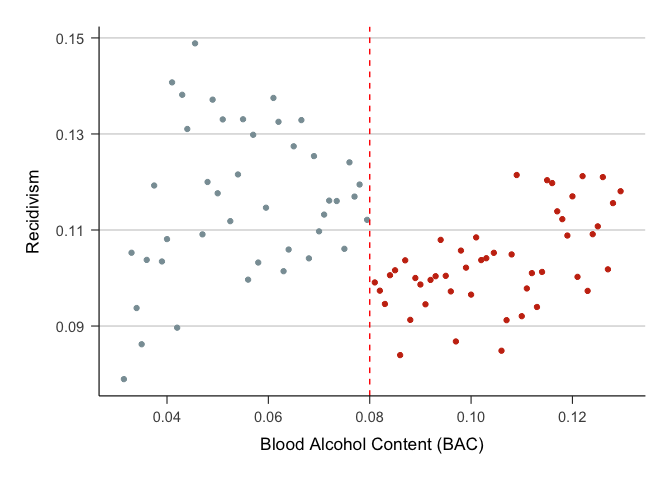

20221215_main_analysis
================
Yurun (Ellen) Ying
2022-12-15

## Main analysis

Run the main analysis of the effect of treatment (punishment) on
recidivism.

``` r
# analysis officially given in the do file
# get the data within the 0.05 bandwidth
dat_bandwidth_0.05 <- bac_data %>% filter(abs(bac1_ctd) <= 0.05)

# linear regression
recidivism_linear_a <- 
  dat_bandwidth_0.05 %>% 
  lm(recidivism ~ dui*bac1 + white + male + acc + aged,
     data = .)
summaryR.lm(recidivism_linear_a, type = "hc1")
```

    ## Loading required package: car

    ## Loading required package: carData

    ## 
    ## Attaching package: 'car'

    ## The following object is masked from 'package:dplyr':
    ## 
    ##     recode

    ## The following object is masked from 'package:purrr':
    ## 
    ##     some

    ## 
    ## Call:
    ## lm(formula = recidivism ~ dui * bac1 + white + male + acc + aged, 
    ##     data = .)
    ## 
    ## Residuals:
    ##      Min       1Q   Median       3Q      Max 
    ## -0.14367 -0.11932 -0.10644 -0.08617  0.96543 
    ## 
    ## Coefficients:
    ##               Estimate Std. Error t value Pr(>|t|)    
    ## (Intercept)  1.094e-01  1.314e-02   8.320  < 2e-16 ***
    ## dui         -5.907e-02  1.521e-02  -3.883 0.000103 ***
    ## bac1        -4.287e-02  1.866e-01  -0.230 0.818332    
    ## white        1.622e-02  2.802e-03   5.789  7.1e-09 ***
    ## male         3.318e-02  2.329e-03  14.247  < 2e-16 ***
    ## acc          4.210e-03  3.452e-03   1.219 0.222665    
    ## aged        -8.537e-04  8.497e-05 -10.047  < 2e-16 ***
    ## dui:bac1     4.381e-01  2.038e-01   2.150 0.031587 *  
    ## ---
    ## Signif. codes:  0 '***' 0.001 '**' 0.01 '*' 0.05 '.' 0.1 ' ' 1
    ## 
    ## Residual standard error: 0.3085 on 89959 degrees of freedom
    ## Multiple R-squared:  0.003644,   Adjusted R-squared:  0.003566 
    ## F-statistic: 51.13 on 7 and 89959 DF,  p-value: < 2.2e-16
    ## 
    ## Note: Heteroscedasticity-consistent standard errors using adjustment hc1

``` r
# quadratic model
recidivism_qua_a <- 
  dat_bandwidth_0.05 %>% 
  lm(recidivism ~ dui*(bac1 + bac1_sq) + white + male + acc + aged,
     data = .)
summaryR.lm(recidivism_qua_a, type = "hc1")
```

    ## 
    ## Call:
    ## lm(formula = recidivism ~ dui * (bac1 + bac1_sq) + white + male + 
    ##     acc + aged, data = .)
    ## 
    ## Residuals:
    ##      Min       1Q   Median       3Q      Max 
    ## -0.14704 -0.11889 -0.10633 -0.08583  0.96541 
    ## 
    ## Coefficients:
    ##               Estimate Std. Error t value Pr(>|t|)    
    ## (Intercept)  2.617e-02  4.732e-02   0.553   0.5802    
    ## dui          1.130e-01  8.426e-02   1.341   0.1798    
    ## bac1         2.902e+00  1.637e+00   1.773   0.0763 .  
    ## bac1_sq     -2.472e+01  1.374e+01  -1.799   0.0720 .  
    ## white        1.622e-02  2.802e-03   5.790 7.08e-09 ***
    ## male         3.321e-02  2.329e-03  14.262  < 2e-16 ***
    ## acc          4.184e-03  3.451e-03   1.212   0.2254    
    ## aged        -8.538e-04  8.497e-05 -10.048  < 2e-16 ***
    ## dui:bac1    -4.210e+00  2.111e+00  -1.994   0.0461 *  
    ## dui:bac1_sq  3.273e+01  1.510e+01   2.167   0.0302 *  
    ## ---
    ## Signif. codes:  0 '***' 0.001 '**' 0.01 '*' 0.05 '.' 0.1 ' ' 1
    ## 
    ## Residual standard error: 0.3085 on 89957 degrees of freedom
    ## Multiple R-squared:  0.003697,   Adjusted R-squared:  0.003598 
    ## F-statistic: 40.23 on 9 and 89957 DF,  p-value: < 2.2e-16
    ## 
    ## Note: Heteroscedasticity-consistent standard errors using adjustment hc1

``` r
# get the data within the 0.025 bandwidth
dat_bandwidth_0.025 <- bac_data %>% filter(abs(bac1_ctd) <= 0.025)

# linear regression
recidivism_linear_b <- 
  dat_bandwidth_0.025 %>% 
  lm(recidivism ~ dui*bac1 + white + male + acc + aged,
     data = .)
summaryR.lm(recidivism_linear_b, type = "hc1")
```

    ## 
    ## Call:
    ## lm(formula = recidivism ~ dui * bac1 + white + male + acc + aged, 
    ##     data = .)
    ## 
    ## Residuals:
    ##      Min       1Q   Median       3Q      Max 
    ## -0.14392 -0.11723 -0.10479 -0.08299  0.96339 
    ## 
    ## Coefficients:
    ##               Estimate Std. Error t value Pr(>|t|)    
    ## (Intercept)  0.1132520  0.0277550   4.080 4.50e-05 ***
    ## dui         -0.0643427  0.0350143  -1.838   0.0661 .  
    ## bac1        -0.1955582  0.3825057  -0.511   0.6092    
    ## white        0.0175942  0.0038129   4.614 3.95e-06 ***
    ## male         0.0357191  0.0031666  11.280  < 2e-16 ***
    ## acc          0.0042208  0.0049681   0.850   0.3956    
    ## aged        -0.0007579  0.0001154  -6.570 5.10e-11 ***
    ## dui:bac1     0.5470655  0.4493585   1.217   0.2234    
    ## ---
    ## Signif. codes:  0 '***' 0.001 '**' 0.01 '*' 0.05 '.' 0.1 ' ' 1
    ## 
    ## Residual standard error: 0.3063 on 46949 degrees of freedom
    ## Multiple R-squared:  0.003994,   Adjusted R-squared:  0.003845 
    ## F-statistic: 29.17 on 7 and 46949 DF,  p-value: < 2.2e-16
    ## 
    ## Note: Heteroscedasticity-consistent standard errors using adjustment hc1

``` r
# quadratic model
recidivism_qua_b <- 
  dat_bandwidth_0.025 %>% 
  lm(recidivism ~ dui*(bac1 + bac1_sq) + white + male + acc + aged,
     data = .)
summaryR.lm(recidivism_qua_b, type = "hc1")
```

    ## 
    ## Call:
    ## lm(formula = recidivism ~ dui * (bac1 + bac1_sq) + white + male + 
    ##     acc + aged, data = .)
    ## 
    ## Residuals:
    ##      Min       1Q   Median       3Q      Max 
    ## -0.14383 -0.11690 -0.10477 -0.08279  0.96308 
    ## 
    ## Coefficients:
    ##               Estimate Std. Error t value Pr(>|t|)    
    ## (Intercept) -1.042e-01  2.783e-01  -0.375    0.708    
    ## dui          3.714e-01  4.220e-01   0.880    0.379    
    ## bac1         6.167e+00  8.120e+00   0.760    0.448    
    ## bac1_sq     -4.606e+01  5.875e+01  -0.784    0.433    
    ## white        1.759e-02  3.813e-03   4.614 3.96e-06 ***
    ## male         3.575e-02  3.167e-03  11.291  < 2e-16 ***
    ## acc          4.233e-03  4.968e-03   0.852    0.394    
    ## aged        -7.582e-04  1.154e-04  -6.571 5.06e-11 ***
    ## dui:bac1    -1.052e+01  1.061e+01  -0.992    0.321    
    ## dui:bac1_sq  7.127e+01  6.921e+01   1.030    0.303    
    ## ---
    ## Signif. codes:  0 '***' 0.001 '**' 0.01 '*' 0.05 '.' 0.1 ' ' 1
    ## 
    ## Residual standard error: 0.3063 on 46947 degrees of freedom
    ## Multiple R-squared:  0.004017,   Adjusted R-squared:  0.003826 
    ## F-statistic: 22.78 on 9 and 46947 DF,  p-value: < 2.2e-16
    ## 
    ## Note: Heteroscedasticity-consistent standard errors using adjustment hc1

The linear model estimates indicate that receiving punishment decreased
the rate of recidivism by 5.91 percentage point (6.4 percentage when
using 0.025 bandwidth). The quadratic model estimates indicate that
receiving punishment decreased the rate of recidivism by 11.3 percentage
point (37.1 percentage when using 0.025 bandwidth).

Make the scatter plots

``` r
#min_bac <- min(dat_bandwidth_0.05$bac1) 
min_bac <- .030999999
max_bac_lower <- filter(dat_bandwidth_0.05, bac1_ctd < 0)$bac1 %>% max()
max_bac <- max(dat_bandwidth_0.05$bac1)
breaks <- c(seq(min_bac, max_bac_lower, length.out = 43), 
               seq(0.08, max_bac, length.out = 49)[-1])


dat_bandwidth_0.05 %>% 
  # create 90 bins with one break at the cutoff point
  mutate(bins = cut(bac1, breaks = breaks)) %>% 
   # select(bins, bac1) %>% arrange(bac1) %>% View()
  group_by(bins) %>% 
  summarize(
    recidivism = mean(recidivism), # calculate the mean recidivism in each group
    bac = mean(bac1), # roughly the midpoint of each bin
    dui = ifelse(bac >=0.08, 1, 0) %>% factor()
  ) %>% 
  ggplot(aes(x = bac, y = recidivism, color = dui)) +
  geom_point(show.legend = FALSE) +
  geom_vline(xintercept = 0.08, color = "red", linetype = 2) +
  scale_x_continuous(breaks = seq(0.02, 0.14, by = 0.02)) +
  scale_y_continuous(breaks = seq(0.07, 0.15, by = 0.02)) +
  scale_color_discrete(type = wes_palette("Royal1", 2, type = "discrete")) +
  labs(x = "Blood Alcohol Content (BAC)", y = "Recidivism") +
  theme_classic() +
  theme(
    panel.grid = element_blank(),
    panel.grid.major.y = element_line(color = "grey80", size = 0.4),
    axis.line = element_line(size = 0.4),
    axis.text.y = element_text(size = 11, margin = margin(0, 5, 0, 0)),
    axis.text.x = element_text(size = 11, margin = margin(5, 0, 0, 0)),
    axis.ticks = element_line(size = 0.4),
    axis.ticks.length = unit(6, units = "pt"),
    axis.title.y = element_text(size = 13, margin = margin(0, 10, 0, 0)),
    axis.title.x = element_text(size = 13, margin = margin(10, 0, 0, 0)),
    plot.margin = margin(20, 20, 20, 20)
  )
```

<!-- -->

## Notes for improvement

- Donut hole regression for handling heaping
- Consider what controls to put in the model and how they should be put

## Donut hole regression
