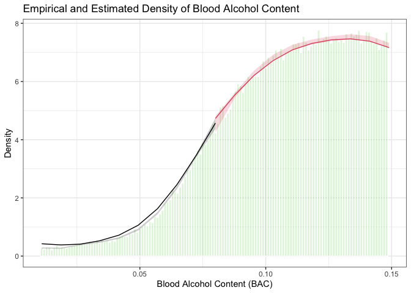

20221215_manipulation_testing
================
Yurun (Ellen) Ying
2022-12-15

## Testing for density discontinuity at the cutoff point

We apply the estimator introduced by [Cattaneo, Jansson, and Ma
(2020)](https://doi.org/10.1080/01621459.2019.1635480). To test whether
there is a discontinuity of the probability density function at the
cutoff point.

``` r
# set cutoff
bac_cutoff <- 0.08

# get a vector of bac1
bac1 <- bac_data %>% pull(bac1)

# test for density discontinuity
bac_manipulation_test <- bac1 %>% rddensity(c = bac_cutoff) # set the cutoff point

# check the results
bac_manipulation_test %>% summary() 
```

    ## 
    ## Manipulation testing using local polynomial density estimation.
    ## 
    ## Number of obs =       214558
    ## Model =               unrestricted
    ## Kernel =              triangular
    ## BW method =           estimated
    ## VCE method =          jackknife
    ## 
    ## c = 0.08              Left of c           Right of c          
    ## Number of obs         23010               191548              
    ## Eff. Number of obs    14727               28946               
    ## Order est. (p)        2                   2                   
    ## Order bias (q)        3                   3                   
    ## BW est. (h)           0.023               0.023               
    ## 
    ## Method                T                   P > |T|             
    ## Robust                -0.1387             0.8897

    ## Warning in summary.CJMrddensity(.): There are repeated observations. Point
    ## estimates and standard errors have been adjusted. Use option massPoints=FALSE to
    ## suppress this feature.

    ## 
    ## P-values of binomial tests (H0: p=0.5).
    ## 
    ## Window Length / 2          <c     >=c    P>|T|
    ## 0.000                     909       0    0.0000
    ## 0.000                     909       0    0.0000
    ## 0.000                     909       0    0.0000
    ## 0.000                     909       0    0.0000
    ## 0.000                     909       0    0.0000
    ## 0.000                     909       0    0.0000
    ## 0.000                     909       0    0.0000
    ## 0.000                     909       0    0.0000
    ## 0.000                     909       0    0.0000
    ## 0.000                     909       0    0.0000

``` r
# get the plot range
plot_min <- bac_cutoff - 3*bac_manipulation_test$h$left
plot_max <- bac_cutoff + 3*bac_manipulation_test$h$right

# plot the results
rdplotdensity(bac_manipulation_test, bac1,
              histBreaks = seq(plot_min, plot_max, by = 0.001) - 0.0005, # adjust the break to remove heaping
              xlabel = "Blood Alcohol Content (BAC)",
              ylabel = "Density",
              title = "Empirical and Estimated Density of Blood Alcohol Content",
              noPlot = TRUE
              ) 
```

    ## $Estl
    ## Call: lpdensity
    ## 
    ## Sample size                                      23010
    ## Polynomial order for point estimation    (p=)    2
    ## Order of derivative estimated            (v=)    1
    ## Polynomial order for confidence interval (q=)    3
    ## Kernel function                                  triangular
    ## Scaling factor                                   0.107239568040194
    ## Bandwidth method                                 user provided
    ## 
    ## Use summary(...) to show estimates.
    ## 
    ## $Estr
    ## Call: lpdensity
    ## 
    ## Sample size                                      191548
    ## Polynomial order for point estimation    (p=)    2
    ## Order of derivative estimated            (v=)    1
    ## Polynomial order for confidence interval (q=)    3
    ## Kernel function                                  triangular
    ## Scaling factor                                   0.892755771193669
    ## Bandwidth method                                 user provided
    ## 
    ## Use summary(...) to show estimates.
    ## 
    ## $Estplot

<!-- -->

We cannot reject the null hypothesis that there is no discontinuity in
the pdf at the cutoff point. The result indicates that there is no
manipulation at the cutoff point.
