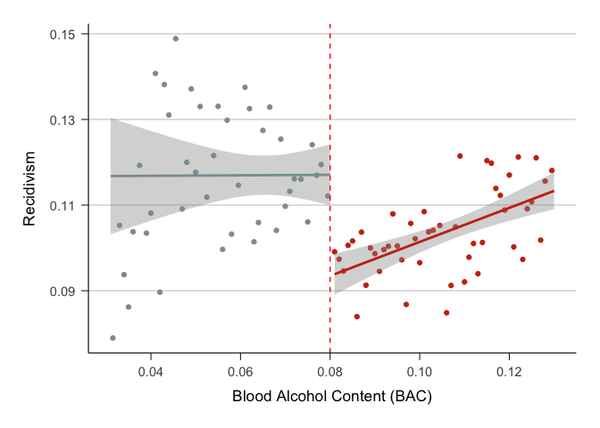
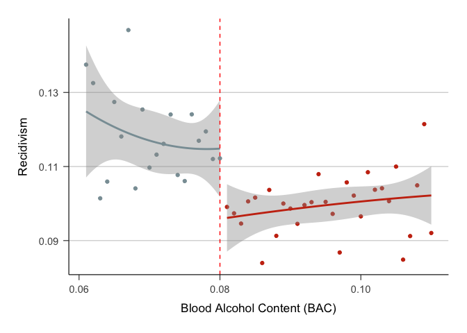

20221217_cmogram_rep
================
Yurun (Ellen) Ying
2022-12-17

Replicate the output given by the `cmogram` function in STATA.

The function choose the number of bins based on the following rule:


The following code reproduce the plot using 0.05 bandwidth.

``` r
# number of breaks left to the cutoff
n_left <- 
  filter(dat_bandwidth_0.05, bac1_ctd < 0) %>% 
  nrow() %>% 
  min(sqrt(.), 10*log(.)/log(10)) %>% 
  floor() + 1
# number of breaks right to the cutoff
n_right <- 
  filter(dat_bandwidth_0.05, bac1_ctd >= 0) %>% 
  nrow() %>% 
  min(sqrt(.), 10*log(.)/log(10)) %>% 
  floor() + 1

#min_bac <- min(dat_bandwidth_0.05$bac1)
min_bac <- .030999999
max_bac_lower <- filter(dat_bandwidth_0.05, bac1_ctd < 0)$bac1 %>% max()
max_bac <- max(dat_bandwidth_0.05$bac1) 
breaks <- c(seq(min_bac, max_bac_lower, length.out = n_left), 
               seq(0.08, max_bac, length.out = n_right))


dat_bandwidth_0.05 %>% 
  # create 90 bins with one break at the cutoff point
  mutate(bins = cut(bac1, breaks = breaks)) %>% 
   # select(bins, bac1) %>% arrange(bac1) %>% View()
  group_by(bins) %>% 
  summarize(
    recidivism = mean(recidivism), # calculate the mean recidivism in each group
    bac = mean(bac1), # roughly the midpoint of each bin
    dui = ifelse(bac >=0.08, 1, 0) %>% factor()
  ) %>% 
  ggplot(aes(x = bac, y = recidivism, color = dui)) +
  geom_point(show.legend = FALSE) +
  # superimpose a fitted line model and confidence interval using the raw data
  geom_smooth(data = dat_bandwidth_0.05,
              aes(x = bac1, y = recidivism, color = dui),
              method = "lm", formula = y ~ x,
              inherit.aes = FALSE, show.legend = FALSE) +
  # # a quadratic model with CI
  # geom_smooth(data = dat_bandwidth_0.05,
  #             aes(x = bac1, y = recidivism, color = dui),
  #             method = "lm", formula = y ~ poly(x, 2),
  #             inherit.aes = FALSE, show.legend = FALSE) +
  # # lowess
  # geom_smooth(data = dat_bandwidth_0.05,
  #             aes(x = bac1, y = recidivism, color = dui),
  #             method = "loess", formula = y ~ x, se = FALSE,
  #             inherit.aes = FALSE, show.legend = FALSE) +
  geom_vline(xintercept = 0.08, color = "red", linetype = 2) +
  scale_x_continuous(breaks = seq(0.02, 0.14, by = 0.02)) +
  scale_y_continuous(breaks = seq(0.07, 0.15, by = 0.02)) +
  scale_color_discrete(type = wes_palette("Royal1", 2, type = "discrete")) +
  labs(x = "Blood Alcohol Content (BAC)", y = "Recidivism") +
  theme_classic() +
  theme(
    panel.grid = element_blank(),
    panel.grid.major.y = element_line(color = "grey80", size = 0.4),
    axis.line = element_line(size = 0.4),
    axis.text.y = element_text(size = 11, margin = margin(0, 5, 0, 0)),
    axis.text.x = element_text(size = 11, margin = margin(5, 0, 0, 0)),
    axis.ticks = element_line(size = 0.4),
    axis.ticks.length = unit(6, units = "pt"),
    axis.title.y = element_text(size = 13, margin = margin(0, 10, 0, 0)),
    axis.title.x = element_text(size = 13, margin = margin(10, 0, 0, 0)),
    plot.margin = margin(20, 20, 20, 20)
  )
```

<!-- -->

Try the 0.02 bandwidth

``` r
# get the data
dat_bandwidth_0.02 <- bac_data %>% filter(bac1 > 0.06 & bac1 < 0.11)

# number of breaks left to the cutoff
n_left <- 
  filter(dat_bandwidth_0.02, bac1_ctd < 0) %>% 
  nrow() %>% 
  min(sqrt(.), 10*log(.)/log(10)) %>% 
  floor() + 1
# number of breaks right to the cutoff
n_right <- 
  filter(dat_bandwidth_0.02, bac1_ctd >= 0) %>% 
  nrow() %>% 
  min(sqrt(.), 10*log(.)/log(10)) %>% 
  floor() + 1

min_bac <- min(dat_bandwidth_0.02$bac1)
#min_bac <- .030999999
max_bac_lower <- filter(dat_bandwidth_0.02, bac1_ctd < 0)$bac1 %>% max()
max_bac <- max(dat_bandwidth_0.02$bac1) 
breaks <- c(seq(min_bac, max_bac_lower, length.out = n_left), 
               seq(0.08, max_bac, length.out = n_right))

dat_bandwidth_0.02 %>% 
  # create 90 bins with one break at the cutoff point
  mutate(bins = cut(bac1, breaks = breaks)) %>% 
   # select(bins, bac1) %>% arrange(bac1) %>% View()
  group_by(bins) %>% 
  summarize(
    recidivism = mean(recidivism), # calculate the mean recidivism in each group
    bac = mean(bac1), # roughly the midpoint of each bin
    dui = ifelse(bac >=0.08, 1, 0) %>% factor()
  ) %>% 
  ggplot(aes(x = bac, y = recidivism, color = dui)) +
  geom_point(show.legend = FALSE) +
  # # superimpose a fitted line model and confidence interval using the raw data
  # geom_smooth(data = dat_bandwidth_0.02,
  #             aes(x = bac1, y = recidivism, color = dui),
  #             method = "lm", formula = y ~ x,
  #             inherit.aes = FALSE, show.legend = FALSE) +
  # a quadratic model with CI
  geom_smooth(data = dat_bandwidth_0.02,
              aes(x = bac1, y = recidivism, color = dui),
              method = "lm", formula = y ~ poly(x, 2),
              inherit.aes = FALSE, show.legend = FALSE) +
  # # lowess
  # geom_smooth(data = dat_bandwidth_0.02,
  #             aes(x = bac1, y = recidivism, color = dui),
  #             method = "loess", formula = y ~ x, se = FALSE,
  #             inherit.aes = FALSE, show.legend = FALSE) +
  geom_vline(xintercept = 0.08, color = "red", linetype = 2) +
  scale_x_continuous(breaks = seq(0.02, 0.14, by = 0.02)) +
  scale_y_continuous(breaks = seq(0.07, 0.15, by = 0.02)) +
  scale_color_discrete(type = wes_palette("Royal1", 2, type = "discrete")) +
  labs(x = "Blood Alcohol Content (BAC)", y = "Recidivism") +
  theme_classic() +
  theme(
    panel.grid = element_blank(),
    panel.grid.major.y = element_line(color = "grey80", size = 0.4),
    axis.line = element_line(size = 0.4),
    axis.text.y = element_text(size = 11, margin = margin(0, 5, 0, 0)),
    axis.text.x = element_text(size = 11, margin = margin(5, 0, 0, 0)),
    axis.ticks = element_line(size = 0.4),
    axis.ticks.length = unit(6, units = "pt"),
    axis.title.y = element_text(size = 13, margin = margin(0, 10, 0, 0)),
    axis.title.x = element_text(size = 13, margin = margin(10, 0, 0, 0)),
    plot.margin = margin(20, 20, 20, 20)
  )
```

<!-- -->
